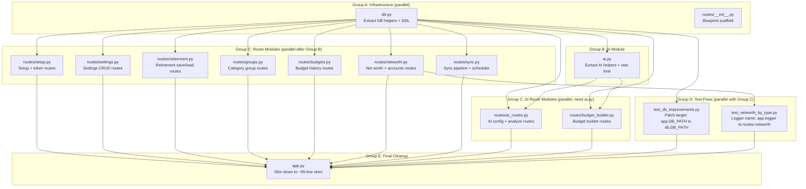
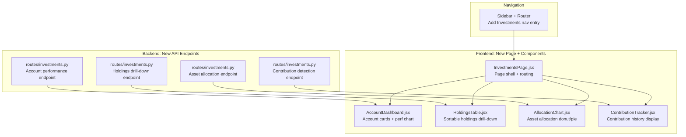
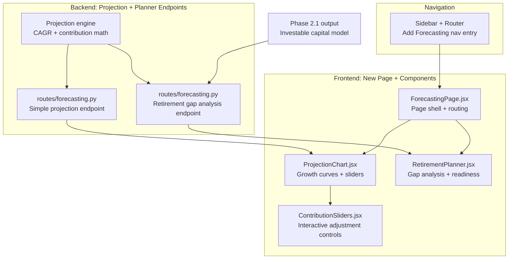
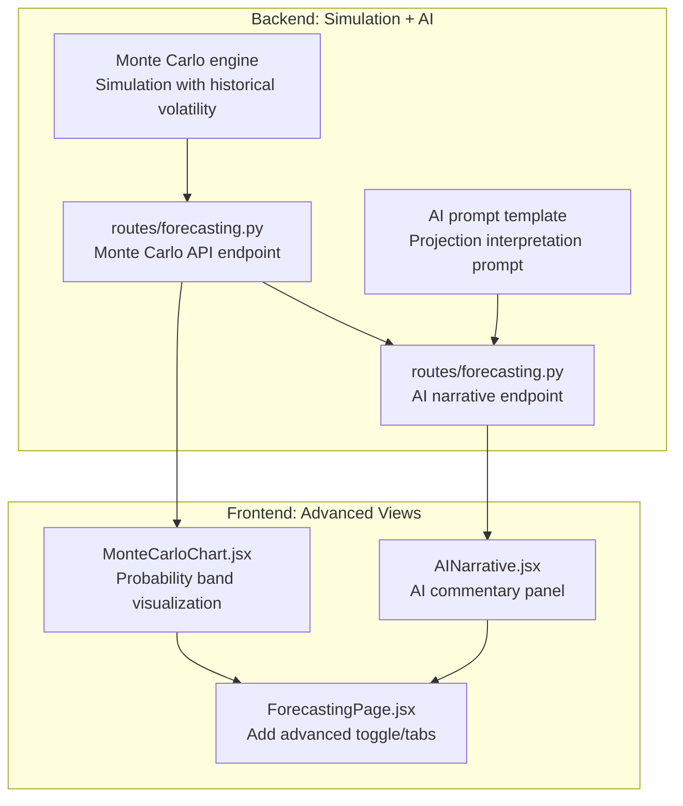
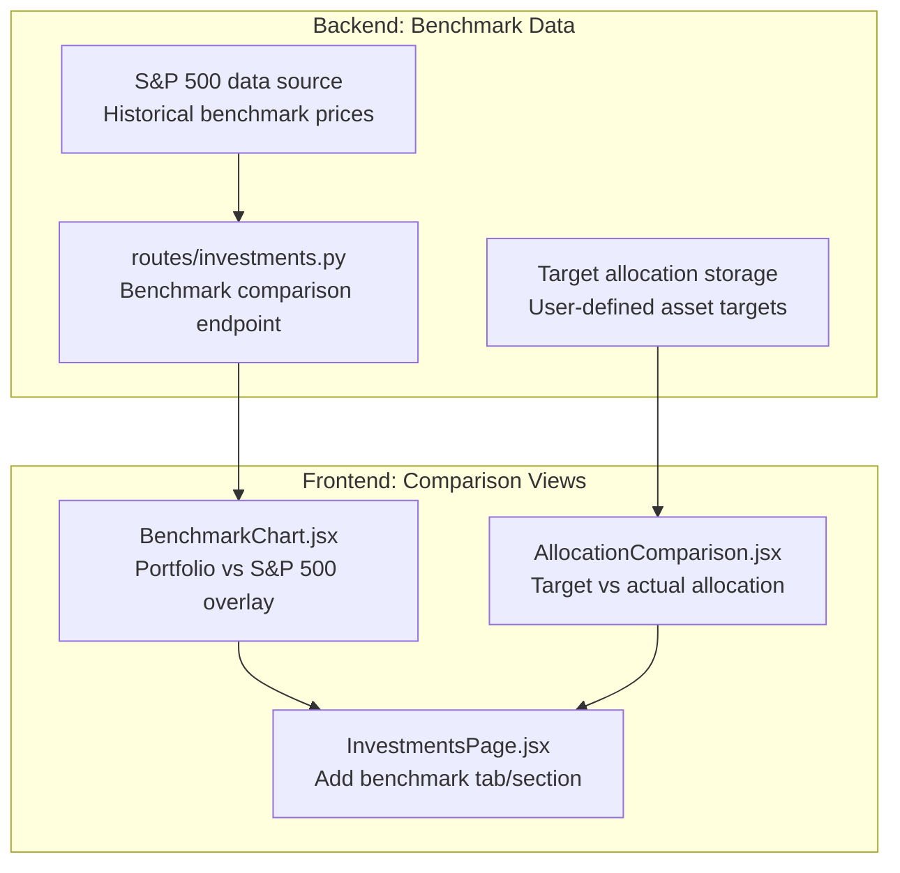
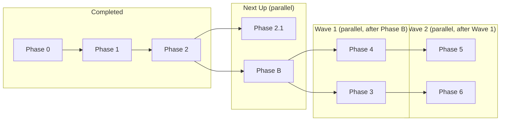

# Phase Dependency Diagrams

Generated: 2026-03-10

**Note:** All phases (B, 3, 4, 5, 6) have completed the full planning pipeline and have final implementation plans ready. Phase 3-6 diagrams show the high-level component structure; see each phase's `*-final-plan.md` for the authoritative implementation details and staff-review corrections.

---

## 1. Cross-Phase Sequencing

This diagram shows which phases must complete before others can begin. Phases 0, 1, and 2 are already merged.

```mermaid
graph TD
    P0["Phase 0: Holdings Sync<br/>(DONE - PR #3)"]
    P1["Phase 1: NW by Account Type + CAGR<br/>(DONE - PR #4)"]
    P2["Phase 2: NW Milestones + Retirement<br/>(DONE - PR #5)"]
    P2_1["Phase 2.1: Investable Capital Fix<br/>(S - Next)"]
    PB["Phase B: Backend Modularization<br/>(M - Planning Done, Ready)"]
    P3["Phase 3: Investments Page<br/>(L - Planning Done, Ready)"]
    P4["Phase 4: Forecasting Page<br/>(L - Planning Done, Ready)"]
    P5["Phase 5: Monte Carlo + AI Narrative<br/>(M - Planning Done, Ready)"]
    P6["Phase 6: Benchmark Comparison<br/>(S - Planning Done, Ready)"]

    P0 --> P1
    P1 --> P2
    P2 --> P2_1

    %% Phase B gates all new feature phases
    PB --> P3
    PB --> P4

    %% Feature dependencies from requirements
    P0 --> P3
    P1 --> P4
    P2 --> P4
    P4 --> P5
    P3 --> P6

    %% Parallel opportunities
    style P3 fill:#2d5a3d,stroke:#4a8c6a
    style P4 fill:#2d5a3d,stroke:#4a8c6a
    style P6 fill:#3d4a5a,stroke:#6a8caa
    style P5 fill:#3d4a5a,stroke:#6a8caa
    style PB fill:#5a3d2d,stroke:#8c6a4a
    style P2_1 fill:#5a3d2d,stroke:#8c6a4a
```

**Key sequencing rules:**

- **Phase B must land before Phases 3-6 begin.** The monolith split avoids merge conflicts as those phases add new routes.
- **Phase 2.1 is independent of Phase B** -- it modifies frontend only (retirement tracker). Can run in parallel with Phase B.
- **Phases 3 and 4 can run in parallel** after Phase B lands, since they target different pages (Investments vs Forecasting) with no shared new code.
- **Phase 5 depends on Phase 4** -- Monte Carlo and AI narrative layer build on the Forecasting page.
- **Phase 6 depends on Phase 3** -- benchmark comparison extends the Investments page.
- **Phases 5 and 6 can run in parallel** since they target different pages.

---

## 2. Phase B: Backend Modularization — Implementation Diagram

Source: `phase-b-final-plan.md`

**Implementer parallelism guidance for Phase B:**

| Step | What | Parallel agents |
|------|------|-----------------|
| 1 | Create `db.py` + `routes/__init__.py` scaffold | 2 agents (or 1, both are small) |
| 2 | Create `ai.py` | 1 agent (blocked on `db.py`) |
| 3 | Create route modules C4-C10 + test fix T1 | Up to 8 parallel agents |
| 4 | Create route modules C11-C12 + test fix T2 | Up to 3 parallel agents (blocked on `ai.py` and `networth.py`) |
| 5 | Final `app.py` slim-down (C13) | 1 agent (blocked on all prior) |

**Gate rule:** Run `make test` after each group completes before proceeding to the next.

---

## 3. Phase 3: Investments Page — Preliminary Diagram

Source: `phase3-final-plan.md`. See final plan for authoritative file list and staff-review corrections.

**Estimated parallel opportunities:**
- All 4 backend endpoints can be built in parallel (independent data queries)
- Frontend page shell + sidebar entry first, then component work in parallel
- Each component can be built independently once its backend endpoint exists

---

## 4. Phase 4: Forecasting Page — Preliminary Diagram

Source: `phase4-final-plan.md`. See final plan for authoritative file list and staff-review corrections.

**Estimated parallel opportunities:**
- Projection engine is a shared dependency -- build first
- Both endpoints can be built in parallel once engine exists
- Sidebar + page shell first, then chart and planner components in parallel

---

## 5. Phase 5: Monte Carlo + AI Narrative — Preliminary Diagram

Source: `phase5-final-plan.md`. See final plan for authoritative file list and staff-review corrections.

**Estimated parallel opportunities:**
- Monte Carlo engine and AI prompt template can be built in parallel
- Monte Carlo endpoint must exist before AI narrative endpoint (narrative interprets simulation results)
- Frontend components can be built in parallel once their endpoints exist
- Page integration (toggle/tabs) is last

---

## 6. Phase 6: Benchmark Comparison — Preliminary Diagram

Source: `phase6-final-plan.md`. See final plan for authoritative file list and staff-review corrections.

**Estimated parallel opportunities:**
- S&P 500 data source and target allocation storage are independent
- Benchmark chart and allocation comparison are independent frontend components
- Page integration is last

---

## 7. Full Implementation Sequence Summary

**Critical path:** Phase B --> Phase 4 --> Phase 5 (longest dependency chain for new features).

**Total waves:** 4 sequential waves with parallelism within each:
1. **Done:** Phases 0, 1, 2
2. **Next:** Phase 2.1 + Phase B (parallel)
3. **Wave 1:** Phase 3 + Phase 4 (parallel, after Phase B)
4. **Wave 2:** Phase 5 + Phase 6 (parallel, after their respective dependencies)
